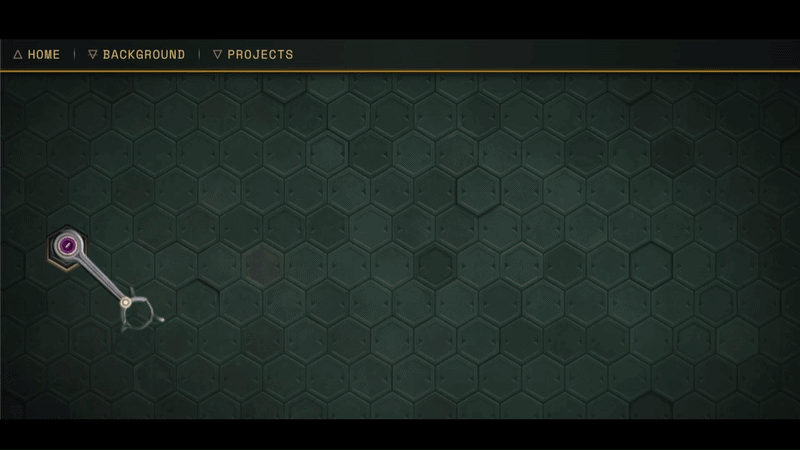

# Personal Website

Interactive, Industrial-themed React / Vite Website Hosted on Vercel to display my Projects, Accomplishments, and Interests.

<p align="center">
    
</p>
<p align="center">
    <a href="https://my-portfolio-pi-sand-83.vercel.app">Link to the Website!</a>
</p>


---

## Description

### Features

- **Opus Magnum Theme**
- **CSS Animations**
- **API Integrations** with Last.FM, Leetcode, and Github
- **Fully Responsive** across mobile, tablet, and desktop viewports
- **Local Caching** to manage API rate limits

---

### Design

The visual design of the website takes heavy inspiration from Opus Magnum, particularly its mechanical and industrial aesthetic. I'm also experimenting with animations and interactive elements to make the website feel less like a traditional portfolio and more like an interactive project.

---

### Quick Start & Local Development

To run this project locally on your machine, follow these steps:

1. **Clone the repository:**

   ```bash
   git clone [https://github.com/sourish-d/Portfolio-Website.git](https://github.com/sourish-d/Portfolio-Website.git)
   cd Portfolio-Website
   cd my-portfolio
2. **Install Dependencies**

    ```bash
    npm install
3. **Run developmenet Server**

    ```bash
    npm run dev

---

### Technical Choices

The project started as a vanilla HTML/CSS/JS site, but was transitioned to React and Vite to handle the growing component tree, easily re-use assets, and use more complex state logic.

The integration of the Leetcode and Github APIs didn't have to be on the backend, but because of that it caused the site to call upon the API a lot more frequently, which during development, caused me to run out of tokens. To circumvent this problem, I stored the info that comes from the API into a local cache, that way when I do reload the site, it pulls from the cache rather than using those tokens all over again.

---

### Credits

- Framework & Built Tool: **React, Vite, and Vercel**
- Design Inspiration: **Opus Magnum (Zachtronics)**
- Typography: **Google Fonts**

**The website is currently under development, but you're free to explore for now! Thanks for checking out my project!**
